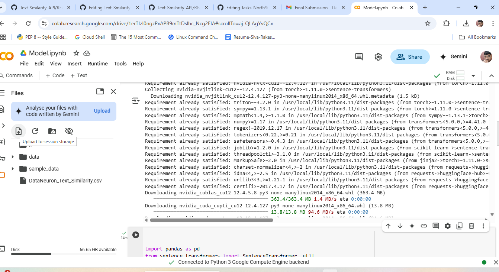
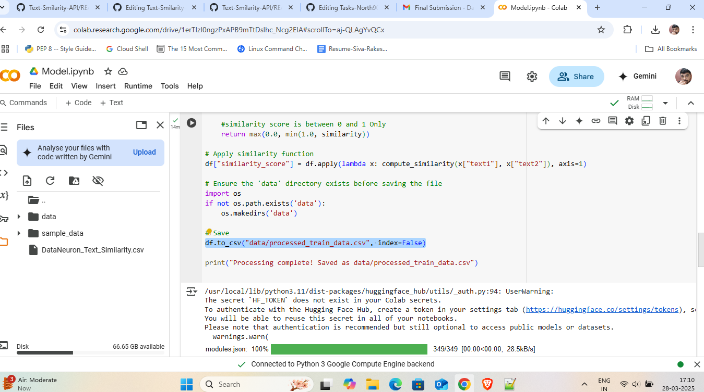
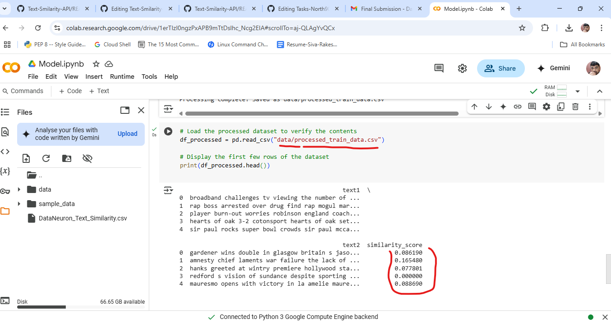

# Text-Smilarity-API
## How to use API Just follow these Steps
 #### Download files app.py and requirements.txt
## Setup Instructions
1. **Set Up Virtual Environment**:
   ```bash
   conda create -p envtext python=3.13 -y

   


2. **Activate Environment**:
   ```bash
   conda activate ./envtext

3. **Install Dependencies**:
   ```bash
   pip install -r requirements.txt


3. **Run python**:
   ```bash
   python app.py


5. **Open the postman and API URL is:**:
   ```bash
   http://127.0.0.1:5000/predict


# Another Way to get the Score bewteen two Texts using Google Collab and Dataset(Contains text1 and text2) 






